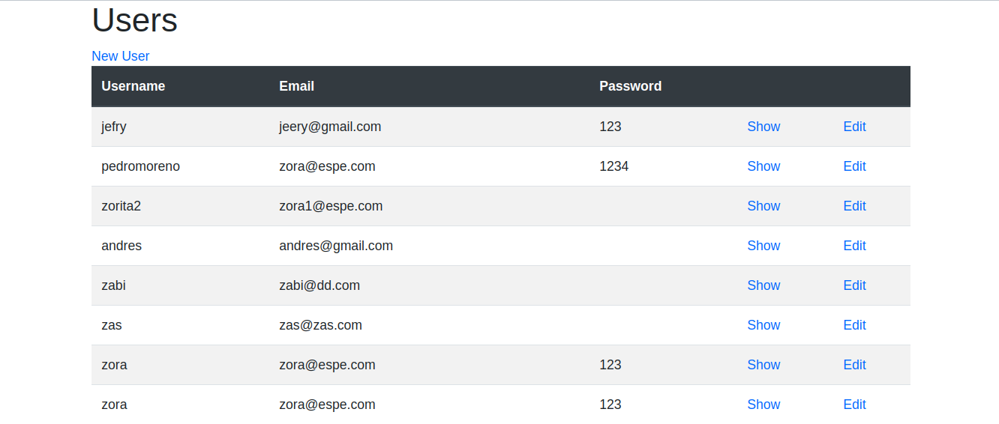

# Re-former
This project focuses on forms, you can create, and edit a user, display all the users on a form and also display a single user on a different page. This is built with ruby on rails framework and is proposed on the website the oding project, and it is also an assignment for microverse.



## Author:
 👤 **Gonza Javier Mancilla**

- Github: [@github/gonjavi](https://github.com/gonjavi)
- Linkedin: [linkedin](https://www.linkedin.com/in/g-javier-mancilla-a686a9178/)


## Built With
```bash
  Ruby 2.6.3
 ```
 ```bash
   Ruby on Rails 6.0.0
 ```
  ```bash
   Html5
 ```
  ```bash
   CSS3 - scss
 ```
  ```bash
Boostrap
```
  ```bash
   JavaScript
  ```
  ```bash
 sqlite3
  ```

## Setup
Clone the project on your local machine and run the following commands:
  ```bash
 $ yarn install
   ```
```bash
$ bundle install
 ```
  ```bash
 $ rails server
```

## 🤝 Contributing

Contributions, issues and feature requests are welcome!


## Show your support

Give a ⭐️ if you like this project!


## 📝 License

This project is [MIT](lic.url) licensed.

